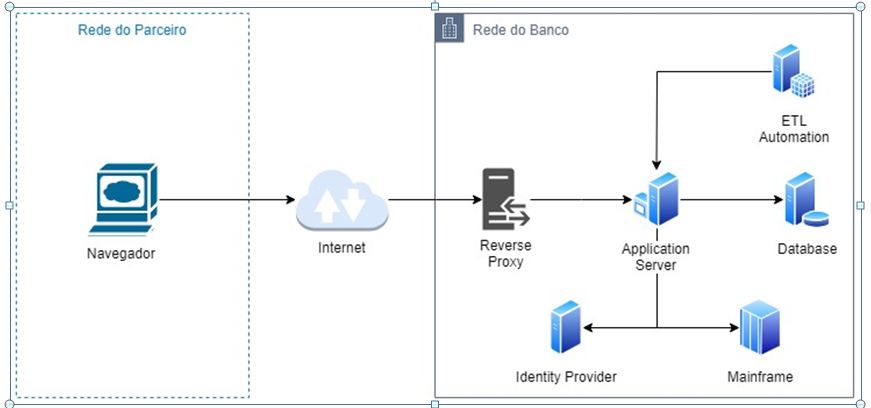
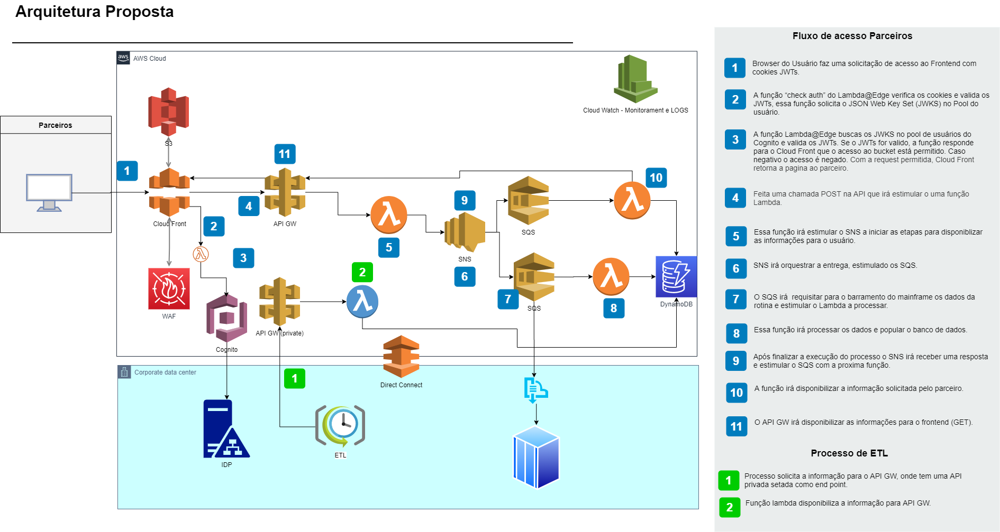
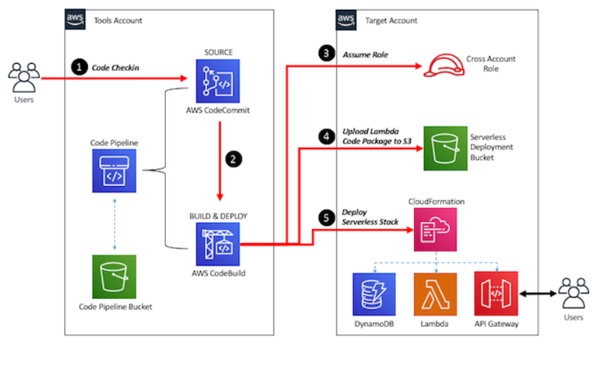

# arq_test
**AS-IS**

Desenho da solução TO BE:

**Ambiente de CI/CD**

**Objetivos alcançados:**

- [x] Migrar ambiente para cloud publica AWS.
- [x]  Aplicar estilos e arquiteturais modernos.
- [x] Base de código dividida em functions (Lambda).
- [x] Esteira de desenvolvimento e implantação automática.
- [x] Componentes utilizados permitem ao ambiente ter uma resiliência maior.
- [x] Utilização do serviço Cloud Watch que permite uma consulta de LOGs de forma eficaz. 
- [x] Integração do serviço do Cognito com o IDP interno.

Referências:

Cognito:
https://aws.amazon.com/pt/blogs/networking-and-content-delivery/authorizationedge-using-cookies-protect-your-amazon-cloudfront-content-from-being-downloaded-by-unauthenticated-users/

CI/CD:
https://aws.amazon.com/pt/blogs/devops/building-a-ci-cd-pipeline-for-cross-account-deployment-of-an-aws-lambda-api-with-the-serverless-framework/

Logs:
https://docs.aws.amazon.com/pt_br/AmazonCloudWatch/latest/logs/WhatIsCloudWatchLogs.html

Integração API Gateway x Cloud Front:
https://aws.amazon.com/pt/premiumsupport/knowledge-center/api-gateway-cloudfront-distribution/

